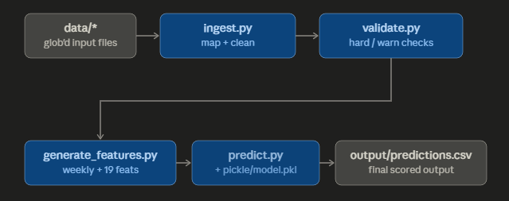

# Architecture

## Scoring pipeline



## The scoring contract, and how each requirement is met

| Grader requirement | Where it's satisfied |
|---|---|
| `./run.sh DATA_DIR MODEL_PATH OUTPUT_PATH` | `run.sh`, 3 positional args + defaults, `set -euo pipefail` |
| Fresh env, `pip install -r requirements.txt` | every version pinned; scoring deps only |
| Held-out data dropped into `data/` | glob + column-fingerprint file identification; no filenames hardcoded |
| No retraining | pre-trained `pickle/model.pkl` committed; self-contained bundle |
| Deterministic | seeds fixed; no randomness at predict time |
| No network / prompts / absolute paths | scoring modules import nothing network-capable; test-enforced |
| Fresh output every run | `to_csv(..., index=False)` overwrite, never append |

## The model bundle (self-contained pickle)

```python
{
  "p10" / "p50" / "p90":  XGBRegressor (quantile objective),
  "feature_cols":          ordered feature list,
  "channel_enc" / "camptype_enc":  plain-dict label encoders,
  "conformal_correction":  float (recomputed at train time),
  "spend_share":           DataFrame — historical campaign-type spend share
                           per channel (REQUIRED at predict time; held-out
                           data can't reproduce it),
  "calibration":           before/after coverage stats,
  "trained_on":            UTC timestamp,
}
```

Plain-dict encoders (instead of sklearn objects) shrink the unpickling
surface: only pandas/numpy/xgboost need to match, and all are pinned.

Unseen categories at predict time encode to −1 — XGBoost treats it as just
another numeric value, so new campaign types in held-out data degrade
gracefully instead of crashing.

## Robustness decisions worth noticing

- **Column-fingerprint file detection.** The grader's files could be renamed;
  we identify Google/Meta/Bing exports by their characteristic columns.
- **Validation with severity levels.** Hard errors abort (`set -euo pipefail`
  surfaces them); data-quality warnings are logged and the run continues.
  The pipeline never silently emits a bad predictions file.
- **Horizons anchored to the data.** Forecast windows start at the last date
  present in the (held-out) data, not a calendar constant.
- **Spend shares renormalized over present groups.** If held-out data lacks
  some campaign types, bundle shares are renormalized over what exists; fully
  unknown groups fall back to their observed share in the new data.
